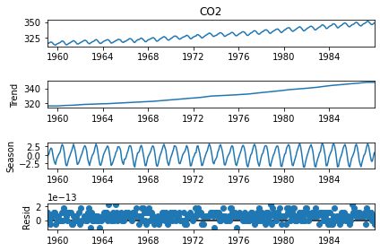

# Summary
Seasonal-Trend Decomposition are commonly used to break time series data into distinct seasonal, trend, and residual components.
By breaking time series data into these distinct components it is easier to distinguish the underlying patterns of the data associated with long-term trends or associated with short-term seasonal fluctuations. 
# Statement of Need
Seasonal-Trend Decompositions are widely used across a variety of fields. 
Fields where time series data is commonplace such as economics or hyrdologic geology benefit from seasonal-trend decompositions 
to better understand the vast amount of time series data. 
Various seasonal trend decomposition methods exist and can be accessed through Python or R libraries
such as Seasonal-Trend Decomposition using Regression (STR) and Seasonal-Trend Decomposition using LOESS (STL).
While the STR and STL methods are easily accessible, they can become computationally slow if used with large datasets. 
The Seasonal-Trend decomposition using the Fast Fourier transform allows for decreased computation time as compared to STR and STL. 
With the STF() python library, fast and accurate seasonal-trend decompositions can be computed even with very large time series datasets. 

# Example

# How It Works

# Features

The package includes the following features:

- Feature 1
- Feature 2

The package can be downloaded through the [Python Package Index](https://pypi.org/project/stf-decomposition/).
The full code is publicly available on [github](https://github.com/thodson-usgs/stf-decomposition).
Documentation, including an API reference, can be found at [Read The Docs](https://stf-decomposition.readthedocs.io/en/latest/).

# Citations

Citations to entries in paper.bib should be in
[rMarkdown](http://rmarkdown.rstudio.com/authoring_bibliographies_and_citations.html)
format.

If you want to cite a software repository URL (e.g. something on GitHub without a preferred
citation) then you can do it with the example BibTeX entry below for @fidgit.

For a quick reference, the following citation commands can be used:
- `@author:2001`  ->  "Author et al. (2001)"
- `[@author:2001]` -> "(Author et al., 2001)"
- `[@author1:2001; @author2:2001]` -> "(Author1 et al., 2001; Author2 et al., 2002)"

# Figures

Figures can be included like this:

and referenced from text using \autoref{fig:example}.

Figure sizes can be customized by adding an optional second parameter:
{ width=20% }

# Acknowledgements

Funding for this research was provided by the Hydro-terrestrial Earth Systems Testbed (HyTEST) project of the U.S. Geological Survey Integrated Water Prediction program.
Any use of trade, firm, or product names is for descriptive purposes only and does not imply endorsement by the U.S. Government.

# References
